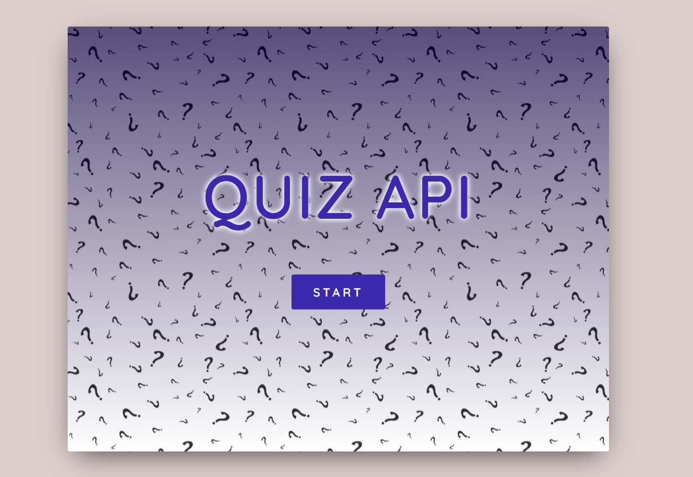
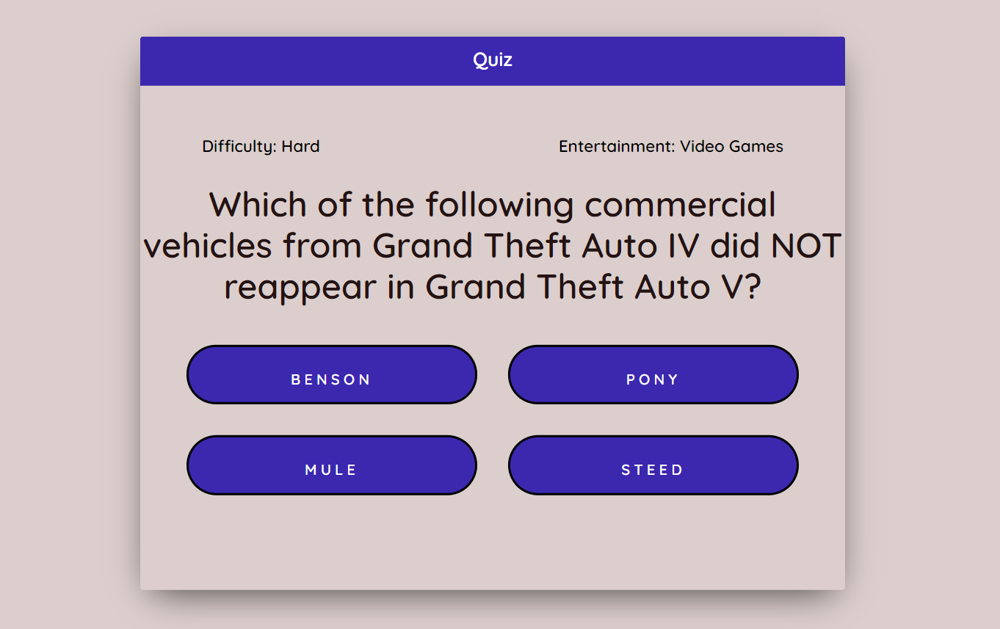
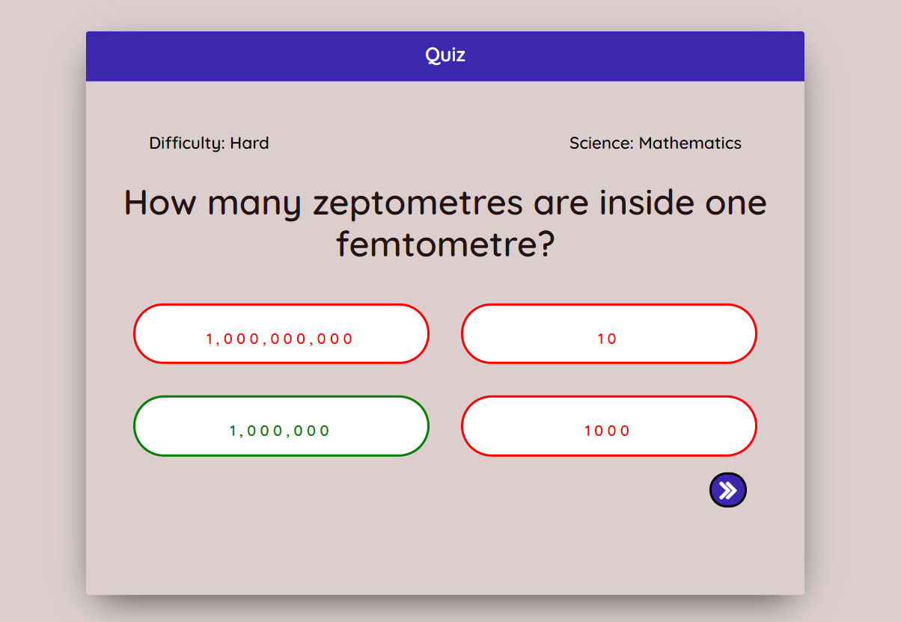

# Quiz API project using react, react router, hooks and sass.

* Download or clone the repository
* Open project in the terminal and install the node modules - npm install
* Run npm start to launch the project.

# Game overview

***********************************************************************************************

***********************************************************************************************

